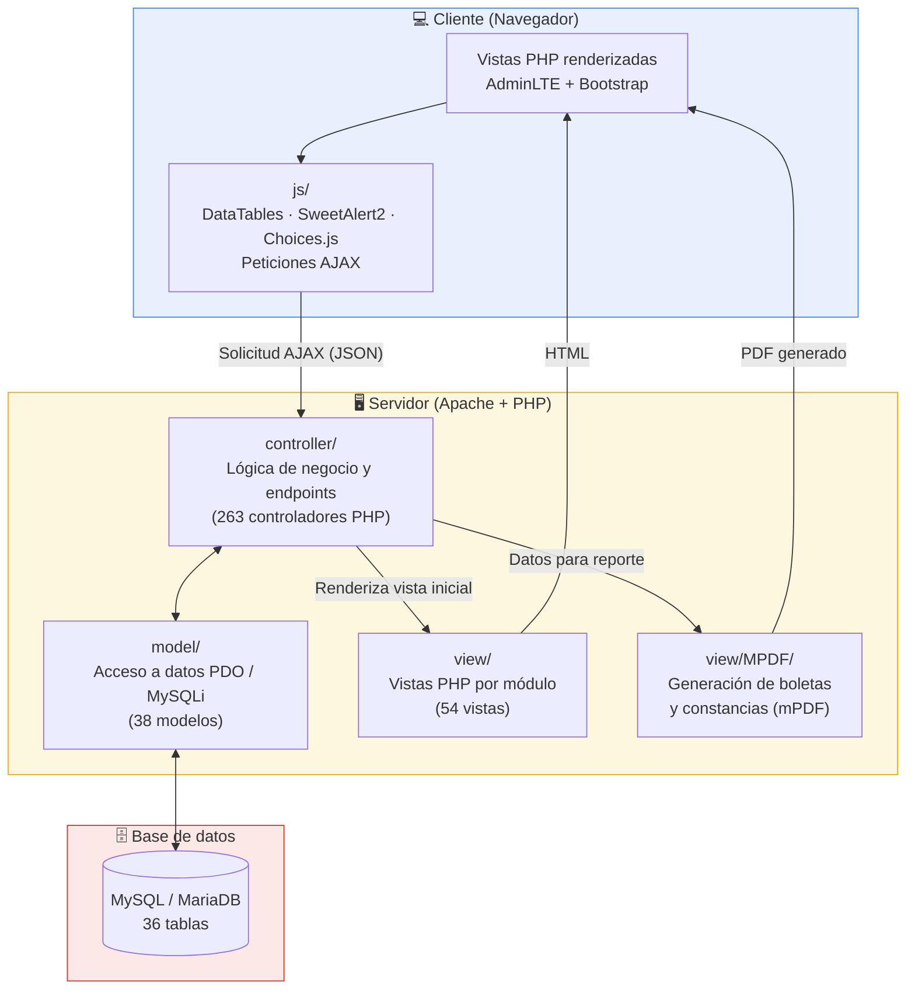

# 🏫 Colegio Sedes Sapientae — Sistema de Gestión Académica

Sistema web integral de gestión escolar desarrollado para el **Colegio Sedes Sapientae**, orientado a digitalizar los procesos académicos, administrativos y financieros de la institución bajo una arquitectura **MVC** en PHP puro.

> Proyecto desarrollado con fines de investigación, práctica profesional y mejora continua.

---

## 📋 Tabla de contenidos

- [Descripción general](#-descripción-general)
- [Módulos principales](#-módulos-principales)
- [Tecnologías utilizadas](#-tecnologías-utilizadas)
- [Arquitectura](#-arquitectura)
- [Métricas del proyecto](#-métricas-del-proyecto)
- [Instalación](#-instalación)
- [Configuración de base de datos](#-configuración-de-base-de-datos)
- [Roles de usuario](#-roles-de-usuario)
- [Capturas / Manual](#-manual-de-usuario)
- [Derechos de autor y licencia](#-derechos-de-autor-y-licencia)
- [Autor](#-autor)

---

## 📖 Descripción general

El sistema permite administrar de forma centralizada toda la operación de una institución educativa: matrícula de estudiantes, asignación de docentes y cursos, control de asistencia, registro de notas y exámenes, tareas virtuales, comunicados, pensiones e ingresos/egresos, atención de enfermería y psicología, generación de reportes en PDF (boletas, constancias) y un landing page institucional para solicitudes de información.

## 🧩 Módulos principales

| Módulo | Funcionalidad |
|---|---|
| **Alumnos / Docentes / Personal administrativo** | Registro, edición, fotos y baja de usuarios del colegio |
| **Matrícula** | Inscripción de estudiantes por año escolar, nivel y aula |
| **Asignaturas y horarios** | Gestión de cursos, asignación docente-curso y horarios por aula |
| **Asistencia** | Control diario de asistencia por aula y por estudiante, con reportes |
| **Notas y exámenes** | Registro de criterios de evaluación, notas por periodo y exámenes |
| **Tareas virtuales** | Publicación, entrega y calificación de tareas entre docentes y alumnos |
| **Pensiones e ingresos/egresos** | Control de pagos de pensión, ingresos y egresos con indicadores |
| **Enfermería y psicología** | Registro de atenciones de salud y seguimiento psicológico |
| **Comunicados** | Publicación de avisos institucionales |
| **Reportes PDF** | Boletas de notas y reportes generados con mPDF |
| **Solicitudes / Landing page** | Formulario público de solicitud de información con seguimiento administrativo |
| **Usuarios y roles** | Control de acceso por rol (administrador, docente, alumno, padre, etc.) |

## 🛠 Tecnologías utilizadas

- **Backend:** PHP (procedural + POO, patrón MVC)
- **Base de datos:** MySQL / MariaDB (PDO y MySQLi)
- **Frontend:** HTML5, CSS3, JavaScript, jQuery
- **Plantilla UI:** AdminLTE v3.0.1 + Bootstrap
- **Componentes:** DataTables, SweetAlert2, Choices.js
- **Reportes:** mPDF (generación de PDF)

## 🏗 Arquitectura

El proyecto sigue el patrón **MVC (Modelo - Vista - Controlador)**, con un flujo de petición/respuesta vía AJAX entre el cliente y el servidor:



**Estructura de carpetas:**

```
├── controller/   # Lógica de negocio y endpoints (AJAX/PHP) por módulo
├── model/        # Acceso a datos (PDO / MySQLi) por entidad
├── view/         # Vistas PHP + reportes PDF (mPDF)
├── js/           # Lógica de cliente por módulo (DataTables, formularios, AJAX)
├── img/          # Recursos gráficos institucionales
└── plantilla/    # Plantilla administrativa AdminLTE
```

## 📊 Métricas del proyecto

| Métrica | Cantidad |
|---|---|
| Controladores PHP | 263 |
| Modelos PHP | 38 |
| Vistas PHP | 54 |
| Scripts JS de módulos | 45 |
| Tablas en base de datos | 36 |
| Líneas de código PHP (aprox.) | ~28,100 |
| Líneas de código JS propio (aprox.) | ~23,800 |
| Módulos funcionales | 12+ |

> *Métricas calculadas sobre el código propio del sistema (excluye librerías de terceros como AdminLTE, DataTables y mPDF/vendor).*

## 📈 Mejoras frente al proceso manual

Beneficios que aporta la digitalización de los procesos del colegio respecto a la gestión tradicional en papel/Excel:

- **Centralización de la información**: alumnos, docentes, notas, asistencia, pagos y tareas en un solo sistema, eliminando registros duplicados en cuadernos y hojas de cálculo sueltas.
- **Generación automática de reportes**: boletas de notas y constancias se generan en PDF (mPDF) en segundos, en lugar de elaborarse manualmente.
- **Trazabilidad de pagos**: control de pensiones, ingresos y egresos con indicadores, reduciendo errores de cálculo y pérdida de comprobantes físicos.
- **Acceso por roles en tiempo real**: docentes, alumnos y padres consultan notas, tareas, horarios y asistencia sin depender de comunicados impresos.
- **Seguimiento de solicitudes**: el formulario público de la landing page permite registrar y dar seguimiento a solicitudes de información, antes gestionadas solo por teléfono o presencialmente.
- **Reducción de uso de papel**: tareas, comunicados y boletas se gestionan de forma digital.

> *Estos beneficios se derivan de las funcionalidades implementadas; las cifras exactas de ahorro de tiempo o costos dependerán de la medición en el entorno real de uso del colegio.*

## 🚀 Instalación

1. Clonar el repositorio dentro de tu servidor local (XAMPP/WAMP):
   ```bash
   git clone https://github.com/jersson14/colegio_sedes_sapientae.git
   ```
2. Importar la base de datos `colegio.sql` (estructura de ejemplo, no incluida en este repositorio público) en tu gestor MySQL.
3. Configurar la conexión a base de datos (ver sección siguiente).
4. Levantar Apache/MySQL y acceder a `index.php` desde el navegador.

## 🔐 Configuración de base de datos

Por seguridad, este repositorio **no incluye las credenciales reales ni los dumps `.sql` de producción**. Se incluyen archivos de ejemplo que debes completar con tus propios datos:

- [`model/model_conexion.php`](model/model_conexion.php) — conexión PDO
- [`view/MPDF/conexion.php`](view/MPDF/conexion.php) — conexión MySQLi para reportes

```php
$host       = "localhost";
$puerto     = 3306;
$usuario    = "tu_usuario";
$contrasena = "tu_contraseña";
$bdName     = "colegio";
```

## 👥 Roles de usuario

- Administrador
- Docente
- Estudiante
- Padre de familia
- Personal administrativo (secretaría, enfermería, psicología, etc.)

## 📘 Manual de usuario

Se incluye un manual de usuario detallado del sistema (`manual_usuario.pdf`) con la guía de uso por cada módulo y rol.

## ⚖️ Derechos de autor y licencia

```
© 2026 Jersson Corilla. Todos los derechos reservados.
```

Este proyecto fue desarrollado por **Jersson Corilla** con fines de investigación académica, portafolio profesional y mejora continua. Se permite la revisión del código con fines de aprendizaje; **no está permitido su uso comercial, redistribución o reutilización total/parcial sin autorización expresa del autor**.

Las librerías de terceros incluidas (AdminLTE, Bootstrap, DataTables, mPDF, Choices.js, etc.) mantienen sus propias licencias originales y son propiedad de sus respectivos autores.

## 👤 Autor


© 2026 Jersson Corilla. Todos los derechos reservados.

---

<p align="center">Hecho con dedicación para la gestión educativa digital 🎓</p>
