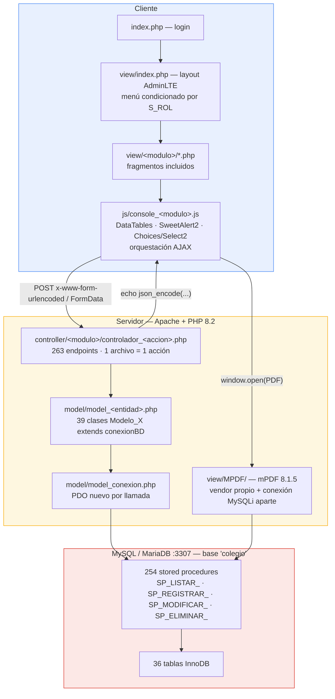
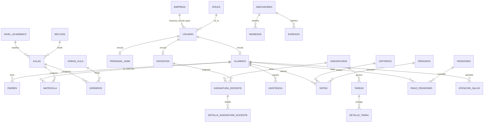
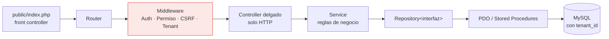

# Arquitectura del sistema

> Estado: **as-is** (lo que hay hoy, sin idealizar). Fecha de análisis: 2026-09-20.
> Rama `main`, commit base `5f180bb`.

---

## 1. Visión general

Aplicación web monolítica en PHP sin framework. Implementa un MVC "manual":
el controlador es un archivo `.php` invocado directamente por su ruta física,
el modelo es una clase que abre PDO y llama a un procedimiento almacenado, y la
vista es un fragmento HTML incluido dentro de un layout AdminLTE único.



---

## 2. Flujo de una petición (trazado real)

### Ejemplo A — Login

1. `index.php` renderiza el formulario. `onclick="Iniciar_Sesion()"`.
2. `js/console_usuario.js:1` → `$.ajax('controller/usuario/controlador_iniciar_sesion.php', {u, c})`.
3. `controlador_iniciar_sesion.php` → `Modelo_Usuario::Verificar_Usuario($usu, $con)`.
4. `model_usuario.php` → `CALL SP_VERIFICAR_USUARIO(?)` con el **usuario únicamente**;
   trae el hash y hace `password_verify($con, $resp['usu_contra'])` en PHP. Correcto.
5. Devuelve el array del usuario como JSON (o `0`).
6. **El JS lee `data[0][15]` (rol) y hace un segundo POST** a
   `controlador_crear_sesion.php` con id, usuario, nombres, **rol**, foto, móvil, DNI…
7. `controlador_crear_sesion.php` hace `session_start()` y escribe todo en `$_SESSION`
   **confiando en lo que llegó del navegador**.
8. Redirección a `view/index.php`, que solo comprueba `isset($_SESSION['S_ID'])`.

> Los pasos 6–7 son el defecto estructural más grave del sistema. Ver [SEGURIDAD.md](SEGURIDAD.md) §H-01.

### Ejemplo B — Listar alumnos

1. `js/console_alumnos.js` inicializa un DataTable apuntando a `controller/alumnos/controlador_listar_alumnos.php`.
2. El controlador llama `Modelo_Alumnos::Listar_Alumnos()` → `CALL SP_LISTAR_ALUMNOS()`.
3. El modelo arma `$arreglo["data"][] = $fila` (formato que DataTables espera).
4. `echo json_encode($arreglo)` — sin `Content-Type: application/json`, sin paginación en
   servidor: **se envía la tabla completa** y DataTables pagina en el navegador.

### Ejemplo C — Reporte PDF

`js` abre una URL de `view/MPDF/REPORTE/*.php` → ese script usa **MySQLi** con
`view/MPDF/conexion.php` (credenciales duplicadas) → arma HTML → mPDF 8.1.5 lo renderiza.

---

## 3. Capas

### 3.1 Presentación

| Pieza | Descripción |
|---|---|
| `index.php` | Login. El "recuérdame" guarda **usuario y contraseña en `localStorage` en claro**. |
| `view/index.php` | ~1500 líneas. Layout AdminLTE + sidebar con `if ($_SESSION['S_ROL'] == "X")` repetido por rol + includes de todos los módulos. Único punto de entrada autenticado. |
| `view/<modulo>/` | 33 carpetas con fragmentos: modales, formularios, tablas. |
| `view/MPDF/REPORTE/` | Plantillas de boletas y constancias. |
| `landing.html` / `landing.css` / `landing.js` | Landing público independiente. |
| `registrar.php`, `seguimiento.php`, `default.php` | Páginas públicas sueltas (solicitudes y seguimiento de trámite). |
| `plantilla/` | AdminLTE 3.2.0 completo (dist + plugins + docs + pages de ejemplo). |
| `utilitario/DataTables/` | Bundle DataTables 1.13.4. |

**Autorización en la UI**: el menú se dibuja condicionalmente por rol. Es *ocultamiento
visual*, no control de acceso — el endpoint sigue siendo invocable directamente.

### 3.2 Controladores — 263 archivos

Un archivo por acción, agrupados en 33 carpetas de módulo.
Estructura invariable:

```php
<?php
    require '../../model/model_x.php';
    $MX = new Modelo_X();
    $a = htmlspecialchars($_POST['a'], ENT_QUOTES, 'UTF-8');
    $consulta = $MX->Accion($a);
    echo json_encode($consulta);
?>
```

Características observadas:

- Sin `declare(strict_types=1)`, sin namespaces, sin autoload.
- Sin verificación de método HTTP.
- Sin validación de negocio: `htmlspecialchars` es *escapado de salida* usado como si
  fuera *validación de entrada*. No hay comprobación de tipo, rango, formato ni obligatoriedad.
- Sin manejo de errores: si el SP falla, el mensaje de `PDOException` se imprime al cliente
  (`echo 'Falló la conexión: ' . $e->getMessage()` en `model_conexion.php`).
- `strtoupper()` aplicado a casi todo → los datos se almacenan en mayúsculas.
- Acceso directo a `$_POST['x']` sin `isset` → *notices* de PHP en la respuesta JSON.

Módulos (carpetas en `controller/`):

```
alumnos · area · asignaturas · asignatura_docente · asistencias
atencion_enfermeria · atencion_psicologica · aulas · aula_horas · año_escolar
componentes · comunicados · docentes · egresos · empleado · empresa
especialidad · examenes · horarios · indicadores · ingresos · matricula
nivel_academico · notas · pago_pension · pensiones · periodos
personal_administrativo · roles · seccion · tareas · tipo_documento · usuario
```

### 3.3 Modelos — 39 archivos

```php
class Modelo_Usuario extends conexionBD {
    public function Listar_Usuario() {
        $c = conexionBD::conexionPDO();          // abre conexión NUEVA en cada método
        $query = $c->prepare("CALL SP_LISTAR_USUARIO()");
        $query->execute();
        // ...
        return $arreglo;
        conexionBD::cerrar_conexion();           // código muerto: después del return
    }
}
```

Problemas estructurales:

- **Una conexión PDO nueva por cada método invocado.** Sin reutilización.
- `cerrar_conexion()` está **siempre después del `return`** → nunca se ejecuta.
- Herencia usada como sustituto de inyección de dependencias (`extends conexionBD`).
  Imposible de testear sin base de datos real. Viola inversión de dependencias (SOLID-D).
- `fetchAll()` sin `PDO::FETCH_ASSOC` en varios métodos → devuelve índices numéricos
  **y** asociativos; por eso el JS accede por `data[0][15]`. Cambiar el orden de columnas
  de un SP rompe el frontend silenciosamente.
- Métodos con 10–15 parámetros posicionales (`Registrar_Alumnos` recibe 15). Sin DTOs.

### 3.4 Datos

- 36 tablas InnoDB. Charset mezclado: 29 `utf8mb4`, 7 `utf8` (debe unificarse a `utf8mb4`).
- **254 procedimientos almacenados**: la lógica de negocio real del sistema.
- `view/MPDF/conexion.php` usa **MySQLi** con credenciales duplicadas mientras el resto
  usa PDO. Dos drivers, dos configuraciones, una sola base.

Tablas:

```
alumnos · padres · docentes · personal_admi · auxiliar · usuario · roles
matricula · aulas · seccion · nivel_academico · especialidad · asignaturas
asignatura_docente · detalle_asignatura_docente · horarios · horas_aula
asistencia · notas · notas_padre · criterios · indicadores · examen
tareas · detalle_tarea · comunicados · atencion_salud
pensiones · pago_pensiones · ingresos · egresos · periodos
empresa · solicitudes_informacion · log_eventos_alumnos
```

**Anclaje multi-tenant existente (parcial):** tabla `empresa` y columna
`usuario.empresa_id DEFAULT 1`. Las otras 34 tablas **no** tienen discriminador.
Detalle en [MULTITENANT.md](MULTITENANT.md).

**Modelo académico actual**: `nivel_academico` contiene `INICIAL`, `PRIMARIA`,
`SECUNDARIA`, `TODOS`. Está modelado como catálogo editable, lo que facilita extender
a institutos (ciclos/semestres) sin rehacer el esquema base.

**Roles** (tabla `roles`): ESTUDIANTE (1), DOCENTE (2), AUXILIAR (3), ENFERMERA (4),
PSICOLOGA (5), ADMINISTRADOR (9). Los roles son datos, pero los permisos están
**hardcodeados como strings** en `view/index.php` y en los JS. Crear un rol nuevo desde
la UI no le otorga ningún permiso: hay que editar PHP.

---

## 4. Modelo de dominio (entidades núcleo)



---

## 5. Puntos de acoplamiento que condicionan cualquier refactor

| # | Acoplamiento | Impacto |
|---|---|---|
| A1 | La URL del endpoint **es** la ruta del archivo | Introducir un router obliga a reescribir los 45 JS o mantener alias de compatibilidad |
| A2 | El JS accede a columnas por índice numérico (`data[0][15]`) | Cambiar un `SELECT` de un SP rompe la UI sin error visible |
| A3 | Lógica de negocio en 254 SPs | No se puede testear unitariamente en PHP; requiere BD de pruebas |
| A4 | `extends conexionBD` en los 39 modelos | Sin inyección de dependencias → sin mocks |
| A5 | Permisos como strings de rol en vistas y JS | Roles nuevos (p. ej. de institutos) no son configurables |
| A6 | mPDF con vendor y conexión propios | Dos configuraciones de BD que mantener sincronizadas |
| A7 | `view/index.php` monolítico (~1500 líneas) | Todo módulo nuevo lo engorda; alto riesgo de conflicto en git |
| A8 | Sin `empresa_id` en 34 tablas | Multi-tenant requiere migración de esquema + reescritura de los 254 SPs |
| A9 | Sin gestor de dependencias en raíz | No hay forma estándar de añadir librerías (JWT, validadores, logging) |

---

## 6. Arquitectura objetivo (resumen)

Propuesta detallada en [PLAN_DE_TRABAJO.md](PLAN_DE_TRABAJO.md).
En una línea: **conservar el monolito PHP pero dotarlo de front controller, autoload
PSR-4, capa de servicios y repositorios, contexto de tenant obligatorio y suite de
pruebas**, en lugar de reescribir en Laravel de golpe.



Principio rector del refactor: **estrangulamiento progresivo** (Strangler Fig). Los
endpoints antiguos siguen funcionando mientras se migran módulo por módulo detrás del
nuevo front controller, con pruebas de caracterización que congelan el comportamiento
actual antes de tocarlo.
