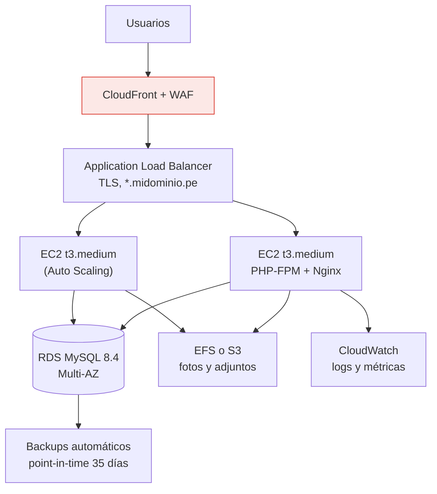

# Viabilidad de despliegue: hosting, VPS, AWS

> Pregunta que responde: ¿dónde se puede levantar este sistema, cuánto cuesta y
> qué hace falta en cada caso?

**Respuesta corta:** técnicamente se despliega en casi cualquier sitio porque es
PHP + MySQL clásico, sin exigencias raras. Lo que condiciona la decisión no es la
tecnología sino el **número de instituciones** y el **estado de seguridad** del código.

> ⚠️ **Precondición innegociable:** con los 4 hallazgos críticos de
> [SEGURIDAD.md](SEGURIDAD.md) sin resolver, este sistema **no debe exponerse a
> internet en ningún proveedor**. Ninguna configuración de infraestructura compensa
> 260 endpoints sin autenticación.

---

## 1. Requisitos mínimos del sistema

| Requisito | Valor | ¿Restrictivo? |
|---|---|---|
| PHP | 8.2+ con `pdo_mysql`, `mysqli`, `mbstring`, `gd`, `zip`, `fileinfo` | No — estándar |
| MySQL / MariaDB | 5.7+ / 10.4+, **con soporte de stored procedures y `CREATE ROUTINE`** | 🟠 Sí en algunos hostings baratos |
| Servidor web | Apache con `mod_rewrite`, o Nginx con reglas equivalentes | No |
| Espacio en disco | ~200 MB código + vendor + fotos y adjuntos (crece) | No |
| Escritura en disco | Necesaria para subidas (fotos, tareas, comunicados) | 🟠 Descarta arquitecturas efímeras sin almacenamiento externo |
| Memoria PHP | 256 MB (mPDF con muchas boletas puede necesitar más) | No |
| `max_execution_time` | 60–120 s para reportes masivos | 🟡 Algunos hostings limitan a 30 s |

**Los dos puntos que realmente filtran proveedores:**

1. **Stored procedures.** Muchos hostings compartidos económicos no otorgan
   `CREATE ROUTINE` ni permiten importar dumps con `DEFINER`. Sin eso, el sistema
   **no arranca**: los 254 SPs son la lógica de negocio.
2. **Sistema de archivos persistente.** Las subidas van a disco. Esto descarta
   plataformas serverless/efímeras (Vercel, Heroku sin addon, App Runner) salvo que
   primero se migre el almacenamiento a S3 o equivalente.

---

## 2. Comparativa de opciones

| Opción | Coste/mes (USD) | Aptitud | Para cuántas instituciones |
|---|---|---|---|
| **A. Hosting compartido cPanel** | 3–15 | 🟡 Condicionada | 1 |
| **B. VPS gestionado (DigitalOcean / Hetzner / Vultr)** | 6–40 | 🟢 **Recomendada** | 1–50 |
| **C. AWS Lightsail** | 5–40 | 🟢 Buena | 1–30 |
| **D. AWS EC2 + RDS** | 60–200+ | 🟢 Escalable | 50+ |
| **E. AWS ECS/Fargate + RDS + S3** | 150–400+ | 🟡 Sobredimensionada hoy | 200+ |
| **F. Servidor propio en el colegio** | Hardware + luz | 🟠 Desaconsejada | 1 |

---

### Opción A — Hosting compartido (cPanel/Plesk)

**Cuándo tiene sentido:** un solo colegio, presupuesto mínimo, sin ambición de SaaS.

✅ A favor: barato, incluye cPanel, phpMyAdmin, correo, certificado SSL gratis,
backups del proveedor, cero administración de sistemas.

❌ En contra:
- **Verificar antes de contratar que permita `CREATE ROUTINE`** e importar los 254 SPs.
  Es el principal motivo de fracaso en esta opción.
- Sin acceso root → no se puede mover el docroot a `public/`, ni afinar PHP, ni
  instalar Composer en muchos casos, ni configurar cron con libertad.
- `max_execution_time` suele estar capado a 30 s → los reportes masivos con mPDF fallan.
- Recursos compartidos: un vecino ruidoso degrada el rendimiento.
- **No sirve para multi-tenant**: no se pueden crear bases de datos por API.

**Proveedores viables en Perú/LatAm:** Hostinger (permite SPs en planes Premium+),
SiteGround, A2 Hosting. Evitar los planes "starter" con límite de 1 base de datos.

**Veredicto:** aceptable solo como continuación del estado actual (un colegio).
Es un callejón sin salida para el plan multi-tenant.

---

### Opción B — VPS · 🟢 **Recomendada para empezar**

**Cuándo tiene sentido:** desde 1 institución hasta ~50. Es el punto óptimo
coste/control para este proyecto.

| Proveedor | Plan sugerido | Precio |
|---|---|---|
| Hetzner (Alemania) | CX22 — 2 vCPU, 4 GB, 40 GB | ~€4.5 |
| DigitalOcean | Basic — 2 vCPU, 4 GB, 80 GB | $24 |
| Vultr | 2 vCPU, 4 GB | $20 |
| Linode/Akamai | 2 vCPU, 4 GB | $24 |
| Contabo | 4 vCPU, 8 GB | ~€6 |

> Para usuarios en Perú, la latencia importa: DigitalOcean/Vultr tienen región en
> São Paulo o Miami. Hetzner es mucho más barato pero está en Europa (~200 ms).
> Con un frontend detrás de Cloudflare la diferencia se atenúa, pero para una
> aplicación con muchas peticiones AJAX pequeñas la región cercana se nota.

**Dimensionamiento estimado:**

| Escenario | vCPU | RAM | Disco |
|---|---|---|---|
| 1 colegio, ~500 alumnos, 50 concurrentes | 2 | 4 GB | 40 GB |
| 5 instituciones, ~2500 alumnos | 4 | 8 GB | 80 GB |
| 20 instituciones, ~10 000 alumnos | 8 | 16 GB | 160 GB + BD separada |

**Stack a instalar:**

```
Ubuntu 24.04 LTS
Nginx + PHP 8.3-FPM   (o Apache si se prefiere mantener .htaccess)
MySQL 8.4 LTS
Certbot (Let's Encrypt, con wildcard *.midominio.pe para los subdominios de tenant)
UFW + fail2ban
Backups: mysqldump diario + rsync/restic a almacenamiento externo (B2, S3, Spaces)
```

✅ A favor: control total, docroot en `public/`, tuning de PHP y MySQL, cron libre,
creación de bases por tenant vía script, coste predecible y bajo.

❌ En contra: administración de sistemas a cargo tuyo (parches, monitoreo, backups),
punto único de fallo si no hay redundancia.

**Veredicto:** la elección correcta para las fases 0–4 del plan.

---

### Opción C — AWS Lightsail

VPS gestionado de AWS con precio fijo. Instancia $10–20/mes + base gestionada opcional
($15+). Puerta de entrada al ecosistema AWS sin la complejidad de EC2/VPC.

✅ A favor: precio fijo, snapshots integrados, ruta de migración a EC2 cuando crezca.
❌ En contra: menos flexible que EC2; región más cercana a Perú es São Paulo o Virginia.

**Veredicto:** buena alternativa a B si ya existe cuenta de AWS o se prevé migrar allí.

---

### Opción D — AWS EC2 + RDS · recomendada a partir de ~50 tenants



**Coste estimado mensual (región sa-east-1, São Paulo):**

| Recurso | Configuración | USD/mes aprox. |
|---|---|---|
| EC2 t3.medium ×2 | 2 vCPU, 4 GB c/u | 80 |
| RDS MySQL db.t3.medium Multi-AZ | 100 GB gp3 | 140 |
| ALB | — | 25 |
| S3 + CloudFront | 100 GB + tráfico | 15 |
| EFS (si se usa) | 50 GB | 15 |
| Backups y snapshots | — | 15 |
| **Total** | | **~290** |

Con instancia única sin Multi-AZ y sin ALB: **~90–110 USD/mes**.
Con Savings Plans a 1 año: −30 % aproximadamente.

⚠️ **São Paulo es la región más cara de AWS.** us-east-1 cuesta ~40 % menos pero añade
~140 ms de latencia desde Perú.

✅ A favor: alta disponibilidad, backups point-in-time, escalado automático, WAF
gestionado, separación de cómputo y datos.
❌ En contra: coste 5–10× el de un VPS, complejidad operativa real (VPC, IAM, security
groups), facturación difícil de predecir.

**Importante para este sistema en EC2/Fargate:** las subidas a disco local **se pierden**
al reemplazar instancias. Hay que migrar el almacenamiento a **S3** (o EFS) antes de
escalar horizontalmente. Está contemplado en el hito 4.6 del plan.

---

### Opción E — Contenedores (ECS/Fargate, EKS)

Solo justificado por encima de ~200 tenants o si se requiere despliegue por regiones.
Exige previamente: almacenamiento en S3, sesiones en Redis/ElastiCache (hoy son
sesiones de archivo de PHP, que no sobreviven a múltiples contenedores), y configuración
totalmente por variables de entorno.

**Veredicto:** no antes de la Fase 4. Prematuro hoy.

---

### Opción F — Servidor propio en la institución

❌ Sin UPS ni redundancia, sin conexión simétrica, sin personal de guardia, sin backup
externo, con riesgo físico (robo, incendio, corte eléctrico) y exposición directa de
datos de menores. Además el acceso remoto de apoderados dependería de la conexión
del colegio.

**Veredicto:** desaconsejada salvo como servidor de respaldo local.

---

## 3. Recomendación por etapa

| Etapa | Infraestructura | Coste/mes |
|---|---|---|
| **Hoy** (desarrollo) | XAMPP local | 0 |
| **Fase 0–2** (1 colegio, tras arreglar seguridad) | VPS 2 vCPU / 4 GB + Cloudflare | $6–24 |
| **Fase 3–4** (2–20 instituciones) | VPS 4 vCPU / 8 GB + BD gestionada + backups externos | $40–80 |
| **Fase 5+** (20–100 instituciones) | AWS Lightsail o EC2+RDS, instancia única | $90–150 |
| **Escala** (100+ instituciones) | EC2 Auto Scaling + RDS Multi-AZ + S3 + CloudFront | $290+ |

**Ruta sugerida:** VPS (Hetzner o DigitalOcean São Paulo) → crecer verticalmente →
separar la base de datos a un servicio gestionado → solo entonces evaluar AWS completo.
Migrar a AWS antes de tener tenants que lo justifiquen es pagar complejidad sin recibir valor.

---

## 4. Checklist previo a producción

**Bloqueantes (sin esto no se despliega):**

- [x] Fase 0 de [SEGURIDAD.md](SEGURIDAD.md) completada y verificada (ZAP, 2026-10-07)
- [ ] **`AllowOverride All`** (o al menos `FileInfo AuthConfig Limit Options Indexes`) en el
      directorio de la app, con `mod_rewrite` y `mod_headers` activos. **Toda la protección de
      `.git`, `*.sql`, `docs/`, `vendor/`, `core/`, `config/` y de las carpetas de subidas está en
      `.htaccess`**: con `AllowOverride None` se ignora en silencio. Verificar tras desplegar:
      `curl -I https://<dominio>/.git/config` → 404 y `curl -I https://<dominio>/colegio.sql` → 403
- [ ] Docroot apuntando a `public/` cuando exista (Fase 3); hasta entonces, lo anterior es obligatorio
- [ ] HTTPS con redirección forzada + HSTS (certificado wildcard si hay subdominios de tenant)
- [ ] `display_errors = Off`, `log_errors = On`, `expose_php = Off` en producción (la app ya fuerza
      `display_errors=0` salvo `APP_DEBUG=true`)
- [ ] `ServerTokens Prod` y `ServerSignature Off` en `httpd.conf` (no se puede desde `.htaccess`)
- [ ] `colegio.env` fuera del docroot (`/var/www/colegio_config/colegio.env`, `chmod 640`,
      dueño `root:www-data`) con `APP_DEBUG=false` — plantilla en `config/colegio.env.example`
- [ ] **`event_scheduler = ON`** en MySQL/MariaDB: 4 eventos de la BD pasan tareas y exámenes
      vencidos a FINALIZADO/REALIZADO y actualizan alumnos al cerrar el año
- [ ] Usuario de MySQL sin privilegios de `root`: `colegio_app` según `config/usuario_bd.sql`
      (EXECUTE + SELECT; INSERT/UPDATE solo en `solicitudes_informacion`), y un usuario de
      migraciones aparte (`DB_MIGRACION_USER`) con DDL, que la aplicación nunca usa
- [x] `phpinfo.php`, `prueba.php`, `test_*` eliminados del repositorio
- [x] `.htaccess` con el motor PHP desactivado en las carpetas de subidas (mover a `storage/`: Fase 3)
- [ ] Backups automáticos **con restauración probada** (un backup no verificado no es un backup)

**Procedimiento de cada despliegue:**

```bash
git pull
composer install --no-dev --optimize-autoloader   # solo Phinx en producción
vendor/bin/phinx migrate                          # la inicial se registra sin tocar el esquema existente
```

> **Migración `20261008000000_corregir_cuentas_e_ingresos`** (cuentas e ingresos): cambia la firma de
> `SP_REGISTRAR_MATRICULA` y `SP_REGISTRAR_DETALLE_PENSION_PAGO`, así que **el código y la migración van
> juntos**: desplegar uno sin el otro rompe la matrícula y el cobro de pensiones. Es reversible
> (`vendor/bin/phinx rollback`, junto con volver al código anterior).
>
> Ingresos históricos mal enlazados (opcional, decisión del responsable): respaldo de la BD y luego
> `php tools/reparar_ingresos.php` (informa) → revisar → `php tools/reparar_ingresos.php --aplicar`.
>
> **Migración `20261009000000_corregir_notas_conceptos_y_orden`**: el SP de notas ahora devuelve el
> total insertado y el controlador nuevo lo compara con lo enviado; también van juntos. Antes de
> recrear cada procedimiento compila la versión nueva con un nombre temporal, así que un error no deja
> la BD sin el procedimiento. Reversible con `rollback`.
>
> **Migración `20261010000000_corregir_modificar_usuario`**: `SP_MODIFICAR_USUARIO` ahora devuelve 1/2
> y el código nuevo lee ese valor (con el SP anterior toda edición respondería 2): **van juntos**.
> El despliegue también añade `core/autoload.php` y `src/`, que el código heredado carga sin Composer.
>
> **Migración `20261011000000_corregir_alumnos`**: `SP_ELIMINAR_ALUMNO` pasa a recibir el DNI como texto y
> devolver 1/0; el código nuevo lee ese valor (con el SP anterior toda baja respondería 0): **van juntos**.
>
> **Migración `20261012000000_corregir_matricula`**: cambia cuándo se puede eliminar una matrícula
> (ya no se borran ingresos cobrados: hay que anularlos antes). Avisar al personal administrativo.
>
> **Migración `20261014000000_corregir_asistencia`**: los registros históricos pueden tener el `mes`
> equivocado y días duplicados. Revisar (y corregir a decisión del responsable, con respaldo):
> `SELECT COUNT(*) FROM asistencia WHERE mes <> MONTH(fecha);` y
> `SELECT id_matricula, fecha, COUNT(*) FROM asistencia GROUP BY 1, 2 HAVING COUNT(*) > 1;`
>
> **Migraciones `20261015000000` a `20261017000000`** (montos, pagos de la matrícula, anulación):
> amplían los montos a `DECIMAL(10,2)` (un `ALTER TABLE` sobre 5 tablas: hacer el respaldo antes), y
> añaden `id_usuario_anulacion` a ingresos y egresos. En los movimientos anulados **antes** de la
> migración, `id_user` ya era quien anuló (el responsable original no es recuperable): la migración lo
> copia a `id_usuario_anulacion`. El código y las migraciones van juntos.
>
> **Migración `20261018000000_corregir_horarios`**: `SP_ELIMINAR_HORARIO` recibe ahora también el año
> (el panel lo envía): van juntos. Las reglas nuevas (celda y docente ocupados) solo se aplican a los
> horarios que se registren. Para revisar los existentes (celdas con dos cursos):
> `SELECT id_hora_aula, dia, COUNT(*) FROM horarios GROUP BY 1, 2 HAVING COUNT(*) > 1;`
>
> **Migración `20261019000000_corregir_pagos_y_caja`**: `SP_ELIMINAR_PAGO_PENSION` recibe ahora también
> quién anula, y los SP de registrar/modificar ingresos, egresos, pensiones y pagos devuelven un
> código que el código nuevo lee: van juntos. Avisar a caja: «anular pago» ya no borra el ingreso.
>
> **Migración `20261020000000_corregir_tareas_y_examenes`**: las entregas fuera de plazo se rechazan
> también en producción, aunque `event_scheduler` esté apagado (se compara con la fecha de entrega).
> Las carpetas nuevas tienen otro formato de nombre; `core/subidas.php` acepta los dos.

**Importantes:**

- [ ] `fail2ban` sobre SSH. El login ya limita intentos (`core/limite_login.php`, registra en el log
      de PHP «Login bloqueado»): `fail2ban` puede leer esa línea para bloquear la IP en el firewall
- [ ] Firewall: solo 80/443 públicos; SSH por clave y con puerto/IP restringidos
- [ ] Monitoreo (UptimeRobot o similar) + alertas de disco lleno y de caída
- [ ] Rotación de logs (logrotate) y retención definida
- [ ] Zona horaria `America/Lima` en PHP y MySQL
- [ ] Charset unificado `utf8mb4` (7 tablas siguen en `utf8`)
- [ ] Cloudflare delante: DDoS, caché de estáticos, WAF básico gratuito
- [ ] Entorno de **staging** idéntico a producción para validar antes de publicar

**Cumplimiento (Ley 29733, datos de menores):**

- [ ] Backups cifrados en reposo
- [ ] Registro de auditoría de accesos a datos sensibles (salud, psicología)
- [ ] Política de retención y borrado documentada
- [ ] Consentimiento informado de los apoderados
- [ ] Contrato de encargo de tratamiento con el proveedor de hosting
- [ ] Preferir región de datos en Latinoamérica (São Paulo) frente a Europa, por
      simplicidad en la transferencia internacional de datos

---

## 5. CI/CD sugerido

```
GitHub Actions
  ├── push a cualquier rama → lint + PHPStan + PHPUnit unitarias
  ├── pull request         → + pruebas de integración con MySQL de servicio
  ├── merge a main         → deploy automático a STAGING
  └── tag v*.*.*           → deploy a PRODUCCIÓN (con aprobación manual)

Despliegue: rsync o deployer.org con releases y symlink
  releases/2026-09-20-1400/   ← nueva versión
  current -> releases/...     ← symlink atómico, rollback en segundos
  shared/{.env, storage/}     ← persistente entre releases
  + phinx migrate por cada tenant
```

**Rollback:** cambiar el symlink `current` a la release anterior. Segundos, no minutos.
Las migraciones de BD deben ser reversibles o compatibles hacia atrás.

---

## 6. Veredicto final

| Pregunta | Respuesta |
|---|---|
| ¿Se puede levantar en hosting compartido? | 🟡 Sí, para **un** colegio, si el proveedor permite stored procedures. Sin futuro multi-tenant. |
| ¿Se puede levantar en VPS? | 🟢 **Sí, y es lo recomendado.** Desde $6/mes. Cubre las fases 0 a 4. |
| ¿Se puede levantar en AWS? | 🟢 Sí, sin obstáculo técnico. Desde ~$90/mes en instancia única; ~$290 con alta disponibilidad. Justificado a partir de ~50 instituciones. |
| ¿Se puede levantar en servidor propio? | 🟠 Técnicamente sí, operativamente desaconsejado. |
| ¿Está listo para producción pública hoy? | 🔴 **No.** Requiere la Fase 0 de seguridad. La infraestructura no es el cuello de botella; el código lo es. |
