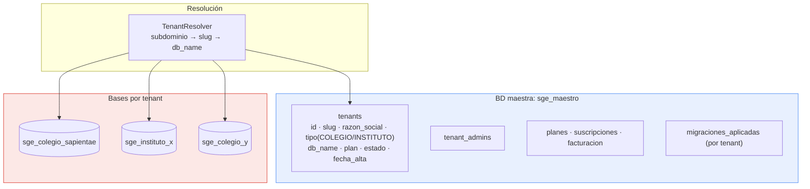

# Viabilidad multi-tenant y soporte para institutos

> Pregunta que responde este documento: ¿se puede convertir este sistema en un SaaS
> que atienda a varios colegios **e institutos** a la vez?

**Respuesta corta: sí, es viable, y el esfuerzo es medio-alto (4–6 meses a tiempo
parcial).** No hace falta reescribir el sistema. Pero sí hay que tocar las 36 tablas,
los 254 procedimientos almacenados y los 263 controladores de forma sistemática.
La buena noticia es que el trabajo es **repetitivo y automatizable**, no creativo.

---

## 1. Punto de partida: qué hay y qué falta

### Ya existe (aprovechable)

| Activo | Estado |
|---|---|
| Tabla `empresa` | Creada, con razón social, código, logo, dirección, email, teléfono. **Es el tenant.** |
| `usuario.empresa_id` | Columna presente con `DEFAULT 1`. El anclaje ya está pensado. |
| Módulo `controller/empresa/` | CRUD de la institución + logo. Base del alta de tenants. |
| `nivel_academico` como catálogo editable | Permite añadir ciclos/semestres sin migración de esquema |
| `roles` como tabla | Permite añadir roles de instituto sin tocar el esquema |
| `periodos` (bimestres) | Reutilizable como semestres/ciclos |

### Falta

| Brecha | Alcance |
|---|---|
| `empresa_id` en 34 tablas | Todas menos `empresa` y `usuario` |
| Filtro de tenant en los 254 SPs | Ninguno filtra por institución |
| Contexto de tenant en la sesión | `$_SESSION` no lleva `empresa_id` |
| Aislamiento de archivos subidos | Todas las fotos van a la misma carpeta |
| Personalización por tenant | Logo, nombre y colores están hardcodeados en vistas |
| Modelo académico flexible | El dominio asume colegio (grados, bimestres, apoderados) |
| Gestión de planes/suscripción | Inexistente |

---

## 2. Decisión clave: ¿qué modelo de aislamiento?

| Modelo | Aislamiento | Coste operativo | Esfuerzo de migración | Escala |
|---|---|---|---|---|
| **A. Base compartida + `empresa_id`** | Lógico | Bajo (1 BD) | Alto (tocar 34 tablas + 254 SPs) | Miles de tenants |
| **B. Una base por tenant** | Fuerte | Alto (N bases, N migraciones) | **Bajo** (casi no se toca el código) | Decenas–cientos |
| **C. Un servidor por tenant** | Total | Muy alto | Nulo | Unidades |
| **D. Híbrido: base por tenant + BD maestra** | Fuerte | Medio | Bajo–medio | Cientos |

### Recomendación: **empezar por D, evolucionar a A si se supera ~100 tenants**

**Por qué no A de entrada**, aunque sea el modelo "de libro":

Con 254 stored procedures, añadir `empresa_id` implica reescribir los 254 con un
parámetro extra y un `WHERE emp.empresa_id = p_empresa_id` en cada join. Un solo SP
olvidado significa que un colegio ve las notas de otro colegio — **fuga de datos de
menores entre instituciones**, el peor fallo posible en este dominio. El riesgo por
error humano es demasiado alto para hacerlo en el primer paso.

**Por qué D funciona hoy:**

- El esquema no cambia. Los 254 SPs siguen igual, sin `WHERE` adicional.
- El aislamiento es estructural: es imposible que un `SELECT` cruce de tenant.
- Cumple mejor con la Ley 29733 (separación efectiva de datos sensibles de menores).
- Un colegio puede pedir su exportación o su borrado: es un `mysqldump` / `DROP DATABASE`.
- Solo hay que cambiar **una cosa**: qué base abre `model_conexion.php`.

**Coste de D:** cada cambio de esquema hay que aplicarlo a N bases (por eso se
necesita un motor de migraciones desde el día uno), y la memoria de MySQL crece con
el número de tablas abiertas (~36 tablas × N).

### Diseño del modelo D



Resolución por **subdominio**: `sapientae.miapp.pe`, `instituto-x.miapp.pe`.
El `TenantResolver` mapea el subdominio a `db_name` consultando la BD maestra
(con caché), y `model_conexion.php` abre esa base. Si el subdominio no resuelve o el
tenant está suspendido → 404, sin filtrar la existencia de otros tenants.

```php
// core/TenantContext.php — el punto único de verdad
final class TenantContext {
    private static ?Tenant $actual = null;

    public static function resolver(string $host): Tenant {
        $slug = explode('.', $host)[0];
        $t = MaestroRepository::porSlug($slug);
        if ($t === null || $t->estado !== 'ACTIVO') {
            http_response_code(404);
            exit;
        }
        return self::$actual = $t;
    }

    public static function actual(): Tenant {
        return self::$actual ?? throw new RuntimeException('Tenant no resuelto');
    }
}
```

**Regla de oro:** `model_conexion.php` **nunca** debe poder abrir una conexión sin
un tenant resuelto. Que lance excepción, no que use un valor por defecto.

> **Implementado (Fase 4):** `src/Tenancy/` y `core/tenant.php`. Hay dos modos con el mismo código,
> `MODO_TENANT=unico` (la institución de `colegio.env`, base `DB_NAME`: hosting compartido o instancia
> dedicada) y `MODO_TENANT=multiple` (este diseño). En modo único el tenant también se resuelve, así
> que el código no distingue los dos casos más allá de la configuración. Despliegue en
> [DESPLIEGUE.md](DESPLIEGUE.md) §7.

---

## 3. Colegio vs Instituto: las diferencias reales de dominio

Esta es la parte que no se resuelve con multi-tenant, sino con **modelado de dominio**.

| Concepto | Colegio (actual) | Instituto / CETPRO | ¿El esquema lo soporta? |
|---|---|---|---|
| Estructura temporal | Año escolar + 4 bimestres | Ciclo / semestre académico (I–VI) | 🟡 `periodos` sirve, pero la UI dice "bimestre" |
| Agrupación de alumnos | Aula (grado + sección) | Sección de ciclo, o matrícula por curso | 🟡 `aulas` sirve; falta matrícula por asignatura |
| Nivel académico | Inicial / Primaria / Secundaria | Programa de estudios / Carrera técnica | ✅ `nivel_academico` es catálogo editable |
| Asignatura | Curso anual | Unidad didáctica con **créditos** y horas | 🔴 Falta `creditos` y `horas_teoricas/practicas` |
| Evaluación | Notas 0–20 por criterio | 0–20 + **créditos aprobados**, promedio ponderado | 🔴 Falta ponderación por créditos |
| Progresión | Promoción de grado | Aprobación por unidad + **prerrequisitos** | 🔴 No existe el concepto |
| Apoderado | Obligatorio (`padres`) | Normalmente no aplica (alumno mayor de edad) | 🟡 Hacer opcional |
| Repitencia | Repite el grado completo | **Repite solo la unidad** (cargo/subsanación) | 🔴 No existe |
| Certificación | Certificado de estudios | Título técnico, certificados modulares | 🔴 Falta módulo |
| Enfermería / psicología | Sí, central | Poco frecuente | ✅ Activable por tenant |
| Asistencia | Diaria por aula | Por sesión de unidad didáctica | 🟡 Requiere ajuste |
| Pensiones | Mensual | Por ciclo o por crédito | 🟡 `pensiones` es flexible |

### Conclusión sobre institutos

El sistema cubre hoy **aproximadamente el 60–65 %** de lo que necesita un instituto.
Lo que ya sirve: usuarios, roles, docentes, asistencia, horarios, tareas, comunicados,
pagos, ingresos/egresos, reportes. Lo que falta es el **núcleo académico específico**:
créditos, prerrequisitos, matrícula por unidad didáctica, repitencia parcial y
certificación modular.

**Esto es desarrollo nuevo, no configuración.** Estimado: 2–3 meses adicionales,
independientes del trabajo multi-tenant.

### Estrategia recomendada: perfiles de institución

En lugar de bifurcar el código, modelar el tipo de institución como **configuración + extensión**:

```
tenants.tipo = 'COLEGIO' | 'INSTITUTO' | 'CETPRO'

tenant_config (clave-valor por tenant):
  periodo.etiqueta        = 'Bimestre' | 'Semestre' | 'Ciclo'
  periodo.cantidad        = 4 | 2
  evaluacion.escala       = 'VIGESIMAL' | 'LITERAL'
  evaluacion.ponderacion  = 'SIMPLE' | 'POR_CREDITOS'
  apoderado.obligatorio   = true | false
  modulos.habilitados     = ['enfermeria','psicologia','tareas',...]
  matricula.modo          = 'POR_AULA' | 'POR_UNIDAD_DIDACTICA'
```

Y las tablas específicas de instituto (`unidades_didacticas`, `prerrequisitos`,
`creditos_alumno`, `certificados_modulares`) existen en el esquema para todos, pero
solo se usan cuando `tipo = 'INSTITUTO'`. Así hay **un solo código base**, que es lo
que hace sostenible un SaaS.

> Esto es aplicar **Open/Closed**: el sistema se extiende con nuevos tipos de
> institución sin modificar el núcleo de matrícula, notas y asistencia.

---

## 4. Trabajo concreto requerido

### 4.1 Infraestructura de tenancy

- [x] BD maestra `sge_maestro` con `tenants` (`database/maestro/`, `phinx_maestro.php`). `planes` y
      `suscripciones` van con la Fase 4B; las migraciones aplicadas quedan en el `phinxlog` de cada base.
- [x] Resolución por subdominio o dominio propio: `App\Tenancy\ResolverTenant` (sin caché: una consulta
      indexada por petición; APCu si algún día pesa).
- [x] `App\Tenancy\TenantContext` como única fuente del tenant activo; no cambia a mitad de petición.
- [x] Ninguna conexión sin tenant: `App\Core\Conexion::crear()` lanza `TenantNoResuelto`; `core/tenant.php`
      lo resuelve en cada petición (404 sin detalles si el host no es de ninguna institución activa).
- [x] La conexión MySQLi de `view/MPDF/` usa la base del tenant (los reportes en uso ya van por PDO).
- [x] Migraciones en N bases: `php tools/migrar_tenants.php` (maestra y cada colegio, se detiene al primer fallo).
- [x] Sesión atada a la institución (`S_TENANT`) y límite de intentos de login por institución.
- [x] Los 4 eventos de la BD, también por cron: `tools/tareas_programadas.php` (hosting sin `event_scheduler`).
- [x] Suite de aislamiento en el CI: `tests/E2E/aislamiento.php`.
- [ ] Proceso automatizado de alta de tenant: crear base → aplicar esquema → sembrar
      catálogos → crear usuario administrador → enviar credenciales.
- [ ] Backup por tenant, con restauración individual probada.

### 4.2 Aislamiento de archivos

Hoy todas las fotos van a `controller/<modulo>/fotos/`. Debe pasar a:

```
/var/app/storage/tenants/<tenant_slug>/fotos/
/var/app/storage/tenants/<tenant_slug>/tareas/
/var/app/storage/tenants/<tenant_slug>/comunicados/
```

Fuera del docroot, servido por un script que valide sesión **y** que el tenant del
archivo coincida con el tenant de la sesión. Esto resuelve además H-03 de
[SEGURIDAD.md](SEGURIDAD.md).

### 4.3 Personalización por tenant

Logo, razón social, colores y datos de cabecera de los PDF deben leerse de `empresa`
del tenant activo, no estar en el HTML. Hoy `view/index.php` e `index.php` tienen
rutas fijas (`img/logo1.png`, `img/fondo.jpeg`) y el título "SEDES SAPIENTIAE" escrito
en duro.

### 4.4 Permisos configurables

Bloqueante para institutos: los roles nuevos (Coordinador Académico, Secretaría
Académica, Jefe de Unidad Didáctica) no pueden requerir editar PHP.

```
permisos (id, clave, descripcion, modulo)         -- 'alumnos.crear', 'notas.editar'
rol_permiso (rol_id, permiso_id)
```

El guard pasa de `exigir_rol('ADMINISTRADOR')` a `exigir_permiso('alumnos.crear')`,
y el menú de `view/index.php` se genera desde los permisos del usuario en lugar de
los 17 bloques `if ($_SESSION['S_ROL'] == "...")` actuales.

### 4.5 Panel de superadministrador

Alta/baja/suspensión de tenants, uso y cuotas, estado de suscripción, métricas
agregadas, acceso de soporte con registro de auditoría (quién entró a qué tenant y cuándo).

---

## 5. Camino de migración a base compartida (modelo A), si se necesita después

Si se superan ~100 tenants y el coste operativo de N bases pesa, la migración a base
compartida se hace así, y **no antes de tener la suite de pruebas completa**:

1. `ALTER TABLE ... ADD COLUMN empresa_id INT NOT NULL` en las 34 tablas + índice
   compuesto `(empresa_id, <pk de negocio>)`.
2. Reescribir los 254 SPs con parámetro `p_empresa_id` — **generable por script** a
   partir del patrón, con revisión manual de los que tienen joins múltiples.
3. Activar **Row-Level Security** vía vistas o, mejor, `CREATE VIEW` por tenant + un
   usuario MySQL por tenant. MySQL no tiene RLS nativa como PostgreSQL: el filtro debe
   ser explícito y **verificado por pruebas automatizadas de aislamiento**.
4. Test obligatorio en CI: para cada uno de los 254 SPs, sembrar dos tenants y afirmar
   que el tenant A jamás obtiene filas del tenant B. Sin este test, no se migra.

> Si alguna vez se evalúa PostgreSQL, su RLS nativa (`CREATE POLICY`) hace el modelo A
> mucho más seguro. Pero migrar 254 SPs de MySQL a PL/pgSQL es un proyecto en sí mismo.

---

## 6. Veredicto de viabilidad

| Objetivo | Viabilidad | Esfuerzo | Riesgo |
|---|---|---|---|
| Multi-tenant con base por tenant (modelo D) | 🟢 **Alta** | 4–6 semanas | Bajo |
| Multi-tenant con base compartida (modelo A) | 🟡 Media | 3–4 meses | **Alto** (fuga entre tenants) |
| Soportar institutos a nivel de configuración | 🟢 Alta | 3–4 semanas | Bajo |
| Soportar institutos a nivel académico completo | 🟡 Media | 2–3 meses | Medio |
| Permisos granulares configurables | 🟢 Alta | 2–3 semanas | Bajo |
| Convertirlo en SaaS comercial | 🟡 Media | 8–12 meses total | Medio |

**Condición previa e innegociable:** la Fase 0 de seguridad. Multi-tenant sobre un
sistema donde 260 endpoints son anónimos no aísla nada — solo multiplica por N el
número de instituciones cuyos datos de menores quedan expuestos.
