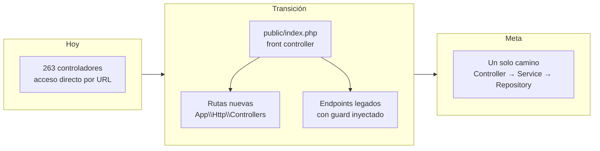
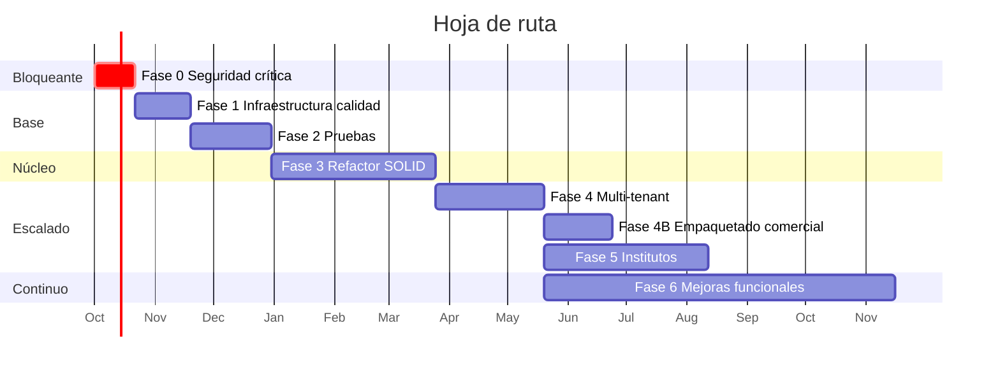

# Plan de trabajo: modernización, calidad y escalado

> Objetivo: llevar el sistema de "aplicación de un colegio en XAMPP" a
> "plataforma SaaS multi-tenant para colegios e institutos", sin detener su
> operación y sin reescribirlo desde cero.

## Estado — 2026-10-07

| Fase | Estado |
|---|---|
| 0 — Seguridad crítica | ✅ Cerrada: OWASP ZAP sin hallazgos altos explotables ([SEGURIDAD.md](SEGURIDAD.md) §0) |
| 1 — Infraestructura de calidad | ✅ Base lista (ver desviaciones) |
| 2 — Pruebas | ✅ Base: 47 unitarias, 31 de integración (incl. SP críticos), 124 respuestas caracterizadas de los 6 roles y 28 comprobaciones E2E; 8 defectos documentados ([tests/README.md](../tests/README.md)) |
| 3 — Refactor | 🔄 En curso: 8 defectos corregidos (3 migraciones); módulo usuario en `src/` (login y gestión de cuentas). Ver [src/README.md](../src/README.md) |
| 4 en adelante | Pendiente |

**Desviaciones de la Fase 1 respecto a lo planeado, y por qué:**

- **No se movió lo heredado a `legacy/` ni el docroot a `public/`.** Todas las URLs del sistema son
  rutas físicas (`controller/x/y.php`, `view/...`): moverlas rompe la aplicación entera. Se hará
  con el front controller de la Fase 3. Mientras tanto, el `.htaccess` raíz bloquea por HTTP
  `vendor/`, `src/`, `tests/`, `database/`, `storage/`, `.git`, `*.sql` y `docs/`.
- **Sin `vlucas/phpdotenv` ni `monolog`.** `core/config.php` ya lee `colegio.env` fuera del docroot
  (Fase 0.4) sin dependencias; Monolog entrará cuando haya registro de auditoría (H-15).
- **CI con MariaDB 10.4 en lugar de MySQL 8.4**: es el motor real del proyecto (XAMPP) y el que
  ejecuta los 254 procedimientos; validar contra otro motor daría falsos verdes o falsos rojos.
- **Phinx en `require` (no `require-dev`)**: producción instala con `--no-dev` y debe poder migrar.
- **Añadido al plan:** el CI también verifica el guard (266/266), la matriz de roles contra la
  interfaz (`tools/analizar_roles.py --estricto`) y secretos en todo el historial (gitleaks).
**Fase 2, notas:** las unitarias de dominio (2.1) llegan con la extracción de servicios de la Fase 3;
el 100 % de los 254 SP con prueba (2.2) sigue siendo meta de la Fase 4. Las escrituras E2E se
envían desde la sesión del navegador con los mismos parámetros que el JS, no clicando formularios.

- **Pendiente de la Fase 1:** proteger `main` en GitHub (Settings → Branches → requerir el check
  «Calidad»), cobertura con Xdebug/PCOV y PHP-CS-Fixer en el hook de pre-commit.

---

## 0. Estrategia general

### Principio rector: Strangler Fig (estrangulamiento progresivo)

No se reescribe. Se levanta una estructura nueva **al lado** de la vieja, se migra
módulo por módulo, y lo antiguo se apaga cuando ya nadie lo usa.



### Por qué no reescribir en Laravel de entrada

- 254 stored procedures contienen la lógica de negocio. Un framework no los traduce.
- 0 pruebas → no hay red de seguridad para verificar que la reescritura hace lo mismo.
- El sistema **está en producción** en un colegio real. Una reescritura de 6–9 meses
  deja ese tiempo sin mejoras y termina en un "big bang" de alto riesgo.
- La deuda crítica es de **seguridad**, y eso se arregla en semanas sobre el código actual.

Laravel (o Symfony) sigue siendo una meta razonable **a partir de la Fase 5**, cuando
ya existan servicios, repositorios y pruebas que hagan la migración incremental y verificable.

### Regla que gobierna todas las fases

> **Ningún refactor se hace sobre código sin prueba de caracterización.**
> Primero se escribe una prueba que congela el comportamiento actual (aunque sea feo),
> luego se refactoriza, luego la prueba debe seguir en verde.

---

## Fase 0 — Seguridad crítica y línea base

**Duración: 2–3 semanas · Bloqueante para todo lo demás**

| # | Entregable | Criterio de aceptación |
|---|---|---|
| 0.1 | Sesión creada en servidor; `controlador_crear_sesion.php` eliminado | Un POST manipulado no otorga rol de administrador |
| 0.2 | `core/guard.php` aplicado a los 263 controladores | Petición anónima a cualquier endpoint devuelve 401 |
| 0.3 | Subida de archivos validada y fuera del docroot | Subir `.php` es rechazado; el archivo no es ejecutable |
| 0.4 | `.env` fuera del docroot + usuario de BD con privilegios mínimos | `grep -r "root" model/` no devuelve credenciales |
| 0.5 | Token CSRF en todas las peticiones no-GET | Petición sin token válido → 419 |
| 0.6 | Archivos de diagnóstico eliminados | `phpinfo.php`, `prueba.php`, `test_*` no existen |
| 0.7 | Contraseña fuera de `localStorage` | El "recuérdame" solo guarda el usuario |
| 0.8 | Cookies endurecidas + `session_regenerate_id` + expiración | Verificado en DevTools |

Detalle y explotación de cada punto en [SEGURIDAD.md](SEGURIDAD.md).

**Prueba de que la fase terminó:** un escaneo OWASP ZAP autenticado y otro anónimo,
sin hallazgos de severidad alta o crítica.

---

## Fase 1 — Infraestructura de calidad

**Duración: 3–4 semanas · Habilita todo el refactor posterior**

### 1.1 Composer y autoload

```json
{
  "require": { "php": ">=8.2", "vlucas/phpdotenv": "^5.6", "monolog/monolog": "^3.7" },
  "require-dev": {
    "phpunit/phpunit": "^11.0",
    "phpstan/phpstan": "^2.0",
    "friendsofphp/php-cs-fixer": "^3.64"
  },
  "autoload":     { "psr-4": { "App\\":   "src/" } },
  "autoload-dev": { "psr-4": { "Tests\\": "tests/" } }
}
```

### 1.2 Estructura objetivo

```
├── public/              # ÚNICO directorio expuesto por Apache
│   ├── index.php        # front controller
│   └── assets/
├── src/
│   ├── Core/            # Router, Request, Response, Container, TenantContext
│   ├── Http/
│   │   ├── Controllers/
│   │   └── Middleware/  # Auth, Permiso, Csrf, Tenant, RateLimit
│   ├── Domain/          # Entidades y objetos de valor (Nota, Dni, Periodo)
│   ├── Services/        # Reglas de negocio
│   ├── Repositories/    # Interfaces + implementación PDO
│   └── Support/         # Validator, Logger, FileStorage
├── tests/
│   ├── Unit/
│   ├── Integration/
│   └── E2E/
├── database/
│   ├── migrations/      # Phinx
│   └── seeders/
├── storage/             # subidas y logs — FUERA del docroot
├── config/
└── legacy/              # controller/ model/ view/ actuales, durante la transición
```

> El cambio de docroot a `public/` es, por sí solo, una de las mejoras de seguridad
> de mayor impacto por menor esfuerzo: deja de ser posible alcanzar `model/`,
> `.env`, `storage/` o `.git` por HTTP.

### 1.3 Herramientas de calidad

| Herramienta | Configuración inicial | Meta |
|---|---|---|
| PHPStan | nivel 5 sobre `src/`, `legacy/` excluido | nivel 8 sobre `src/` |
| PHP-CS-Fixer | PSR-12 | aplicado en pre-commit |
| PHPUnit | 11.x, cobertura con Xdebug | ver Fase 2 |
| Phinx | migración inicial = esquema actual | todo cambio de BD versionado |

### 1.4 CI con GitHub Actions

```yaml
on: [push, pull_request]
jobs:
  calidad:
    steps:
      - php -l en todos los archivos       # lint
      - composer audit                     # CVEs de dependencias
      - vendor/bin/php-cs-fixer --dry-run
      - vendor/bin/phpstan analyse
      - vendor/bin/phpunit --testsuite=Unit
  integracion:
    services: [mysql:8.4]
    steps:
      - phinx migrate && phinx seed:run
      - vendor/bin/phpunit --testsuite=Integration
```

**Regla:** a partir de aquí, `main` protegida. Sin CI en verde no se mergea.

---

## Fase 2 — Estrategia de pruebas

**Duración: 4–6 semanas (y continua después)**

### Pirámide objetivo

```
        /\        E2E (Playwright) — 15-20 flujos críticos
       /  \       ~5 % · lentos · alta confianza
      /----\
     /      \     Integración (PHPUnit + MySQL real) — repositorios y SPs
    /        \    ~25 % · verifican los 254 stored procedures
   /----------\
  /            \  Unitarias (PHPUnit, sin BD) — servicios, validadores, dominio
 /______________\ ~70 % · milisegundos
```

### 2.1 Pruebas unitarias

Solo son posibles **después** de extraer servicios, porque hoy `Modelo_X extends conexionBD`
abre una conexión real en cada método. El orden es: extraer servicio → inyectar
interfaz de repositorio → mockear → testear.

```php
final class CalculoPromedioTest extends TestCase
{
    public function test_promedio_ponderado_por_creditos(): void
    {
        $notas = [new Nota(15, creditos: 4), new Nota(11, creditos: 2)];
        self::assertSame(13.67, (new CalculadoraPromedio())->ponderado($notas));
    }

    public function test_nota_fuera_de_escala_vigesimal_es_rechazada(): void
    {
        $this->expectException(NotaInvalidaException::class);
        new Nota(21);
    }
}
```

Prioridad de cobertura unitaria:
1. Cálculo de notas y promedios (mayor impacto en el alumno si falla).
2. Reglas de matrícula (cupos, duplicados, prerrequisitos).
3. Cálculo de pensiones, moras y saldos.
4. Validadores (DNI, correo, fechas, rangos).
5. Autorización (`¿puede este rol hacer esta acción?`).

### 2.2 Pruebas de integración

Aquí se prueban los **254 stored procedures**, que es donde vive la lógica real.

```php
final class SpListarAlumnosTest extends DatabaseTestCase
{
    public function test_solo_devuelve_alumnos_activos(): void
    {
        $this->seed('alumnos', [
            ['dni' => '12345678', 'estado' => 'ACTIVO'],
            ['dni' => '87654321', 'estado' => 'INACTIVO'],
        ]);
        $filas = $this->pdo->query('CALL SP_LISTAR_ALUMNOS()')->fetchAll();
        self::assertCount(1, $filas);
    }
}
```

Cada prueba corre en una **transacción con rollback** para no ensuciar la base.

### 2.3 Pruebas de caracterización (clave para el refactor)

Antes de tocar un módulo legado, se graba su comportamiento actual:

```php
// Congela lo que hoy devuelve el endpoint, incluso si es raro.
public function test_listar_usuario_mantiene_formato_datatables(): void
{
    $r = $this->post('/controller/usuario/controlador_listar_usuario.php');
    self::assertArrayHasKey('data', $r);
    self::assertIsArray($r['data'][0]);          // índices numéricos Y asociativos
    self::assertSame('ADMINISTRADOR', $r['data'][0][15]);  // el JS depende de esto
}
```

Esto protege contra el acoplamiento A2 de [ARQUITECTURA.md](ARQUITECTURA.md):
el frontend lee columnas por índice, y un cambio de `SELECT` rompe la UI en silencio.

### 2.4 Pruebas E2E

Flujos que deben estar cubiertos sí o sí:

1. Login correcto / incorrecto / usuario inactivo.
2. Matricular un alumno de principio a fin.
3. Registrar notas y generar la boleta PDF.
4. Tomar asistencia de un aula.
5. Registrar un pago de pensión.
6. Publicar una tarea (docente) y entregarla (alumno).
7. **Aislamiento entre tenants**: el usuario del tenant A no ve datos del tenant B.
8. **Autorización**: un docente no puede acceder a endpoints de administrador.

### 2.5 Metas de cobertura

| Ámbito | Meta | Cuándo |
|---|---|---|
| `src/Services` | 90 % | Fase 3 |
| `src/Domain` | 95 % | Fase 3 |
| Stored procedures | 100 % de los 254 con al menos un test | Fase 4 |
| `legacy/` | Sin meta; se cubre al migrar | — |

> La cobertura es un indicador, no el objetivo. Un 90 % con aserciones triviales no
> vale nada. Lo que se exige es que **cada regla de negocio tenga una prueba que falle
> si la regla cambia**.

---

## Fase 3 — Refactor con Clean Code y SOLID

**Duración: 8–12 semanas · Módulo por módulo, nunca todo a la vez**

### Orden de migración de módulos

Por riesgo × valor: primero los de mayor impacto y menor acoplamiento.

```
1. usuario / roles      → habilita permisos granulares (base de todo)
2. alumnos / padres     → entidad central
3. matrícula            → núcleo académico
4. notas / criterios    → mayor lógica de negocio
5. asistencia
6. asignaturas / horarios
7. pensiones / pagos / ingresos / egresos
8. tareas / exámenes
9. comunicados / enfermería / psicología
10. reportes PDF        → último: depende de todos los anteriores
```

### Aplicación de SOLID, con el caso concreto de este código

**S — Responsabilidad única.**
Hoy `controlador_registrar_alumno.php` hace cinco cosas: leer HTTP, sanear, invocar
el modelo, mover un archivo y responder. Se separa en:

```php
final class AlumnoController
{
    public function __construct(
        private readonly RegistrarAlumnoService $service,
        private readonly AlumnoValidator $validator,
    ) {}

    public function registrar(Request $req): Response
    {
        $datos = $this->validator->validar($req->all());   // valida
        $alumno = $this->service->ejecutar($datos, $req->file('foto')); // hace
        return Response::json(['id' => $alumno->id], 201); // responde
    }
}
```

**O — Abierto/cerrado.**
Hoy añadir un tipo de institución obligaría a meter `if ($tipo == 'INSTITUTO')` en
todo el código de notas. En su lugar:

```php
interface EstrategiaEvaluacion { public function promedio(array $notas): float; }
final class EvaluacionVigesimalSimple      implements EstrategiaEvaluacion {}
final class EvaluacionPonderadaPorCreditos implements EstrategiaEvaluacion {}
// El tenant elige la estrategia por configuración. Añadir un tipo = añadir una clase.
```

**L — Sustitución de Liskov.**
Toda implementación de `AlumnoRepositoryInterface` (PDO, en memoria para tests, con
caché) debe ser intercambiable sin que el servicio note la diferencia. Eso es
justamente lo que hace posible testear sin base de datos.

**I — Segregación de interfaces.**
Nada de un `RepositorioGeneral` con 40 métodos. Interfaces pequeñas:
`BuscaAlumnos`, `GuardaAlumnos`, `ListaAlumnosPorAula`. Un consumidor depende solo
de lo que usa.

**D — Inversión de dependencias.**
El cambio más importante. Hoy: `class Modelo_Usuario extends conexionBD` — la clase
de negocio **hereda de la infraestructura**, que es la dependencia invertida al revés.
Objetivo: el servicio depende de una interfaz; el contenedor inyecta la implementación PDO.

### Reglas de Clean Code para este proyecto

| Regla | Situación actual | Objetivo |
|---|---|---|
| Funciones cortas | Métodos de modelo con 15 parámetros posicionales | Máx. 20 líneas, máx. 4 parámetros; más → DTO |
| Nombres reveladores | `$c`, `$MU`, `$resp`, `$arreglo` | `$conexion`, `$repositorioUsuario`, `$filas` |
| Sin código muerto | `cerrar_conexion()` tras cada `return` | Eliminado |
| Sin duplicación | El mismo bloque de `htmlspecialchars` copiado en 263 archivos | Un `Validator` reutilizable |
| Tipado estricto | Ninguno | `declare(strict_types=1)` + tipos en todas las firmas |
| Errores explícitos | `echo` del mensaje de excepción | Excepciones de dominio + manejador central + Monolog |
| Números mágicos | `data[0][15]` en el JS | Respuestas JSON con claves nombradas |
| Un nivel de abstracción | Controladores que mezclan HTTP, validación, BD y ficheros | Cada capa en su nivel |

### Refactor del frontend (paralelo)

- Sustituir el acceso por índice (`data[0][15]`) por claves (`data[0].rol`) — requiere
  cambiar `fetchAll()` a `PDO::FETCH_ASSOC` en los modelos, **con prueba de
  caracterización primero**.
- Extraer de los 45 JS la lógica repetida de AJAX a un cliente único con manejo de
  errores, token CSRF y spinner.
- Paginación en servidor para las tablas grandes (hoy se envía la tabla completa).
- Eliminar `view/index.php` monolítico: un layout + inclusión de módulo por ruta.

---

## Fase 4 — Multi-tenant

**Duración: 6–8 semanas**

Diseño completo en [MULTITENANT.md](MULTITENANT.md). Resumen de hitos:

| Hito | Entregable |
|---|---|
| 4.1 | BD maestra `sge_maestro` + tabla `tenants` |
| 4.2 | `TenantResolver` por subdominio + `TenantContext` |
| 4.3 | `model_conexion` que exige tenant resuelto (excepción si falta) |
| 4.4 | Phinx aplicando migraciones a N bases |
| 4.5 | Alta automatizada de tenant (crear base, sembrar, admin inicial) |
| 4.6 | Almacenamiento de archivos aislado por tenant, fuera del docroot |
| 4.7 | Personalización (logo, razón social, colores, cabecera de PDF) por tenant |
| 4.8 | Panel de superadministrador |
| 4.9 | **Suite de pruebas de aislamiento** — el tenant A nunca ve datos del B |
| 4.10 | Backup y restauración por tenant, probados |

**Puerta de salida:** el hito 4.9 en verde es condición para dar de alta el segundo tenant.

---

## Fase 4B — Empaquetado comercial

**Duración: 4–6 semanas · Puede solaparse con el final de la Fase 4**

La Fase 4 deja el sistema técnicamente multi-tenant. Esta fase lo convierte en algo
**vendible**. Sin ella se puede dar de alta instituciones pero no cobrarles, ni limitar
lo que consumen, ni saber quién está al día.

### Modelo de distribución: un código, tres paquetes

| Paquete | Qué recibe la institución | Infraestructura | Prioridad |
|---|---|---|---|
| **P1 · SaaS compartido** | `suinstitucion.tudominio.pe` | Tu VPS, junto a otros tenants | 🟢 Producto principal |
| **P2 · Instancia dedicada** | Su propia base y su propio VPS, gestionado por ti | Un VPS por cliente | 🟢 Mismo código, N=1 |
| **P3 · Licencia on-premise** | Instalación en su local | Del cliente | 🔴 Excepción, ver §4B.5 |

> **P1 y P2 son el mismo binario.** Con el modelo de base por tenant, una instancia
> dedicada es simplemente un despliegue con un solo tenant registrado. No requiere
> ninguna bifurcación del código ni hito adicional de desarrollo: es una decisión de
> **infraestructura y contrato**, no de producto.
>
> **Regla que no se rompe:** nunca se bifurca el repositorio por paquete comercial.
> Dos ramas significan parchear la seguridad dos veces, y con el historial de
> vulnerabilidades de este sistema eso duplica el riesgo real.

### Hitos

| Hito | Entregable |
|---|---|
| 4B.1 | Tablas `planes`, `suscripciones`, `facturas` en la BD maestra |
| 4B.2 | Límites por plan (alumnos, usuarios, almacenamiento) aplicados en tiempo de ejecución, no solo declarados |
| 4B.3 | Estados del tenant: `PRUEBA`, `ACTIVO`, `MOROSO`, `SUSPENDIDO`, `CANCELADO` — con el comportamiento de la aplicación en cada uno |
| 4B.4 | Medición de consumo por tenant (alumnos matriculados, espacio en disco) |
| 4B.5 | Facturación: emisión, registro de pagos y aviso de vencimiento |
| 4B.6 | Flujo de alta comercial: demo con datos de ejemplo → conversión a cliente |
| 4B.7 | Exportación completa de los datos de un tenant (portabilidad; exigible por Ley 29733) |
| 4B.8 | Baja de tenant: exportación, retención pactada y borrado verificable |
| 4B.9 | Runbook de provisión de instancia dedicada (P2): VPS, despliegue, DNS, TLS, backup |
| 4B.10 | Documentación de operación y manual de la institución |

### Sobre el estado `MOROSO` (4B.3)

Decisión de producto que conviene tomar temprano: **nunca cortar el acceso a los datos
académicos de golpe**. Un colegio que no puede imprimir boletas en semana de entrega de
notas por una factura vencida es un cliente perdido y un problema para las familias.
Degradación recomendada:

```
PRUEBA      → funcional, con marca de agua y límite de alumnos
ACTIVO      → sin restricciones
MOROSO      → aviso visible; lectura y reportes SÍ, altas y matrícula NO
SUSPENDIDO  → solo exportación de datos, 30 días
CANCELADO   → exportación entregada, datos borrados según lo pactado
```

### 4B.5 — Sobre la licencia on-premise (P3)

**No está contemplada como línea de producto, y es deliberado.** Si se decide venderla,
requiere trabajo adicional que hoy no existe en ninguna fase:

| Falta | Esfuerzo |
|---|---|
| Instalador reproducible (Docker Compose o script guiado) | 2–3 semanas |
| Mecanismo de actualización remota o asistida | 3–4 semanas |
| Control de licencia y vigencia | 2 semanas |
| Telemetría mínima de versión instalada (con consentimiento) | 1 semana |
| Soporte de N entornos heterogéneos | Coste **permanente**, no un proyecto |

Riesgos que asume el negocio al venderla, más allá del desarrollo:

- **Se pierde el control de los parches.** Una institución que nunca actualiza queda con
  vulnerabilidades conocidas. Si hay una filtración de datos de menores, el daño
  reputacional recae sobre el producto, no sobre quien no actualizó.
- **El código PHP es legible y copiable.** No hay protección práctica contra la
  redistribución entre instituciones.
- **El soporte deja de ser escalable**: cada instalación tiene su PHP, su MySQL y su
  servidor.

**Condiciones mínimas si se vende de todas formas:** precio sustancialmente mayor,
contrato de soporte anual obligatorio, y cláusula de aceptación de actualizaciones de
seguridad. Tratarla como excepción negociada, nunca como opción de catálogo.

> **Recomendación:** ofrecer P2 (instancia dedicada) como respuesta a la objeción
> "queremos el sistema en nuestro servidor". Cubre la necesidad real —aislamiento de
> datos y sensación de propiedad— conservando el control de las actualizaciones.

### Lo que esta fase NO cubre

Fijación de precios y segmentación de mercado. Requiere investigación con instituciones
reales (entrevistas a 5–10 colegios e institutos sobre presupuesto, ciclo de compra y
quién decide), no una decisión técnica. Debe hacerse **antes** de cerrar 4B.1, porque la
estructura de planes depende de cómo esté dispuesto a pagar el mercado (pago único
vs. suscripción, tarifa plana vs. por alumno matriculado).

---

## Fase 5 — Soporte para institutos

**Duración: 8–12 semanas**

| Hito | Entregable |
|---|---|
| 5.1 | `tenants.tipo` + tabla `tenant_config` clave-valor |
| 5.2 | Etiquetas y cantidad de periodos configurables (bimestre/semestre/ciclo) |
| 5.3 | Tablas `unidades_didacticas`, `creditos`, `prerrequisitos` |
| 5.4 | Matrícula por unidad didáctica (además de por aula) |
| 5.5 | `EstrategiaEvaluacion` con promedio ponderado por créditos |
| 5.6 | Repitencia parcial: cargos y subsanación |
| 5.7 | Apoderado opcional según configuración del tenant |
| 5.8 | Certificación modular y título técnico (plantillas mPDF) |
| 5.9 | Roles y permisos propios de instituto |
| 5.10 | Piloto con un instituto real |

---

## Fase 6 — Mejora funcional continua

Priorizado por valor para la institución:

| Mejora | Valor | Esfuerzo |
|---|---|---|
| Notificaciones por correo y WhatsApp (notas, inasistencias, pagos) | 🟢 Alto | Medio |
| Portal del apoderado (hoy el acceso es limitado) | 🟢 Alto | Medio |
| Aplicación móvil o PWA para alumnos y apoderados | 🟢 Alto | Alto |
| Pagos en línea (Culqi, Niubiz, Izipay, Yape/Plin) | 🟢 Alto | Alto |
| Exportación a formatos oficiales del MINEDU (SIAGIE) | 🟢 Alto | Alto |
| Dashboard analítico (deserción, rendimiento, morosidad) | 🟠 Medio | Medio |
| Firma digital de certificados y constancias | 🟠 Medio | Medio |
| Aula virtual (material, foros, videoconferencia) | 🟠 Medio | Muy alto |
| Importación masiva por Excel | 🟠 Medio | Bajo |
| Reserva y control de biblioteca / laboratorios | 🔵 Bajo | Medio |
| API pública para integraciones | 🔵 Bajo | Medio |

> El repositorio menciona un "sistema web con firma digital" en el manual de usuario
> incluido; conviene revisar ese documento antes de planificar el punto de firma digital.

---

## Cronograma consolidado



> Fase 4B y Fase 5 pueden correr en paralelo: una es comercial y la otra académica,
> y tocan partes distintas del sistema.

**Total hasta SaaS multi-tenant operativo con institutos: ~12 meses** a dedicación
constante de una persona. Con dos desarrolladores, las fases 3 y 5 se paralelizan
parcialmente → ~8 meses.

---

## Indicadores de avance

| Indicador | Hoy | Fase 2 | Fase 4 |
|---|---|---|---|
| Endpoints con autenticación | 3/263 (1 %) | 263/263 | 263/263 |
| Hallazgos críticos de seguridad | 4 | 0 | 0 |
| Cobertura de pruebas | 0 % | 40 % | 70 % |
| SPs con prueba de integración | 0/254 | 100/254 | 254/254 |
| Nivel de PHPStan | — | 5 | 8 |
| Tenants soportados | 1 | 1 | N |
| Tiempo de alta de una institución | manual, días | manual | automatizado, minutos |
| Paquetes comerciales operativos | 0 | 0 | P1 y P2 tras Fase 4B |
| Instituciones facturables sin intervención manual | 0 | 0 | N tras Fase 4B |
